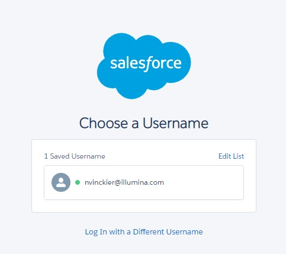

## Installing the CLI
1. Download the TAR file containing the latest stable release of the Salesforce CLI for Linux.  
    ```bash
    wget https://developer.salesforce.com/media/salesforce-cli/sfdx/channels/stable/sfdx-linux-x64.tar.xz
    ```  
  
1. Create the directory where you want to install Salesforce CLI.  

    ```bash
    mkdir ~/sfdx
    ```
  
1. Unpack the contents for your TAR file:  
    * `-C` unpacks the contents in the `~/sfdx directory`, while `--strip-components 1` removes the root path component.  
    ```bash
    tar xJf sfdx-linux-x64.tar.xz -C ~/sfdx --strip-components 1
    ```  
  
1. Update your PATH environment variable to include the Salesforce CLI bin directory. For example, to set it for your current terminal session:  
    ```bash
    export PATH=~/sfdx/bin:$PATH
    ```  
  
1. To update your PATH environment variable permanently, add the appropriate entry to your shell’s configuration file. For example, if you use the Bash shell, add this line to your `~/.bashrc` or `~/.bash_profile` file:  
    ```bash
    PATH=~/sfdx/bin:$PATH
    export PATH
    ```  
  
1. Verify the installation:  
    ```bash
    sfdx --version
    ```  
1. Something like this should print to the terminal.  
    ```bash
    sfdx-cli/7.74.1-32db2396ed wsl-x64 node-v12.18.3
    ```  
## Authenticating the CLI  
1. Close any open Bash (Linux) sessions and open a new one.  
  
1. Log into SFDC as normal in the default web browser.  
  
1. Authenticate the CLI to allow it to access SFDC as your user profile:  
    ```bash
    sfdx force:auth:web:login -a sfdc
    ```
    * The default web browser should open a page that looks like the image below:  
    
