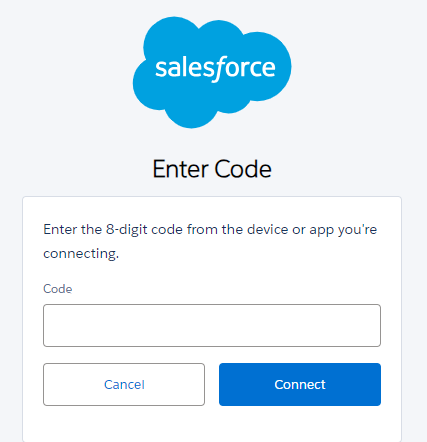

# Salesforce CLI
Instructions for installing the Salesforce CLI tool within a Linux distribution running in WSL2 (Windows Subsystem for Linux).

 
### Installing the CLI

1.  Add the function below to ~/.bashrc (or another file that has been set up to  contain custom functions and is sourced when the terminal is opened e.g. ~/.bash_functions)
    ```bash
    function updateSfCli() {
        rm -rf ~/bin/sf
        mkdir -p ~/bin/sf
        echo "Downloading latest sf cli tarball."
        curl -sS -o ~/Downloads/sf-linux-x64.tar.xz 'https://developer.salesforce.com/media/salesforce-cli/sf/channels/stable/sf-linux-x64.tar.xz'
        echo "Download complete."
        echo "Expanding..."
        tar xJf ~/Downloads/sf-linux-x64.tar.xz -C ~/bin/sf --strip-components 1
        sf --version
    }
    ```
2.  Add `~/bin/sf/bin` to your `$PATH` if it is not already. This can be accomplished by adding the following line to the `~/.bashrc` file.

    ```bash
    export PATH="$PATH:~/bin/sf/bin"
    ```
5.  Source the file(s) containing the updateSfCli function and the `$PATH` variable update.

    ```bash
    source ~/.bashrc
    ```
6.  Execute the update function.

    ```bash
    updateSfCli
    ```
7.  The version of the CLI tool should be printed in the terminal when the function completes.

    ```bash
    Downloading latest sf cli tarball.
    Download complete.
    Expanding...
    @salesforce/cli/2.46.6 wsl-x64 node-v20.14.0
    ```
8.  The CLI can now be updated by re-running the `updateSfCli` function.
    
### Authenticating the CLI

1. Close any open Bash (Linux) sessions and open a new one.
2. Log into SFDC as normal in the default web browser.
3. Run the command below to start the CLI authentication process:
    ```bash
    sf org login device -r https://illumina.my.salesforce.com -a sfdc
    ```

    * A code and URL will be printed in the terminal. Copy the code and navigate to the URL provided.
    * Enter the code in the Code box and that is presented on the web page:  
      
4. Click Connect.
5. A page should appear asking to Allow Access for the CLI. Click **Allow**.
6. Check back in the terminal where a message should indicate the CLI has been authenticated.
