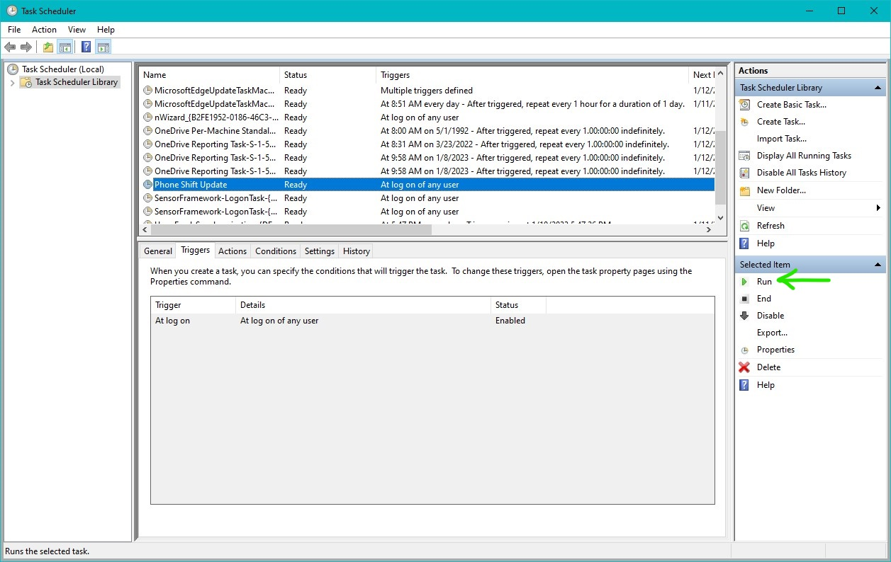

## Configure PowerShell sync script
1. Download the `add_phone_shifts_to_cal.ps1` script from the link below:

    [WIW to Outlook sync script](https://ilmn-my.sharepoint.com/:u:/g/personal/nvinckier_illumina_com/EQdwF1yWJF9CiScUJKdMl7QBojRdrX1h_7sOKnzgOFSuyQ?e=Nz0hZo)

1. Place the .ps1 script in the `C:\Users\%USERNAME%\Documents` directory.  

1. Log into When I Work, Click on `CALENDAR SYNC`

    

1. Copy the `MY SCHEDULE` URL:

    

1.  Open the `add_phone_shifts_to_cal.ps1` script saved to My Documents in a text editor and replace **ENTER MY SCHEDULE ICS URL HERE** with the URL copied in step 4.

    
    * *Be sure to leave the URL enclosed in the single-quotes*:

    

1. ***Optional***: If located outside the Pacific time zone, modify the script to account for the desired time zone. Lines 51 and 57 (shown below) are subtracting 8 hours (28800 seconds) from UTC:

    
    * Modify the time to subtract according to the local time zone:

    |Time Zone|Adjustment from UTC (Standard)|Adjustment from UTC (Daylight)|
    |:--:|:--:|:--:|
    |Pacific|-28800|-25200|
    |Mountain|-25200|-21600|
    |Central|-21600|-18000|
    |Eastern|-18000|-14400|
    |São Paulo|-10800|NA|

1. Save the script after making the above changes.

## Automate schedule sync using **Task Scheduler** 

1. Download the `Phone Shift Update.xml` file from the link below:

    [Phone Shuft Update XML task file](https://ilmn-my.sharepoint.com/:u:/g/personal/nvinckier_illumina_com/EfJ1PAH8UvtGhYW3yIeX8DgB1dYR8ToXkMjqwO8VqOt-aQ?e=fr3aPh)

1. Open the Windows **Task Scheduler** program:

    

1. Click on **Task Scheduler Library**:

    

1. Click `Action > Import Task`:

    

1. Navigate to the `Phone Shift Update.xml` file and click **Open**:

1. Once imported find the new `Phone Shift Update` task and double-click it:

    

1. Under the **General** tab click the **Change User or Group** button:

    

1. Under **Enter the object name to select** type `ILLUMINA\username` and click **OK** and then **OK** again to close the `Phone Shift Update Properties` window:

    

1. Test the task is working properly by selecting it in the Task Scheduler and clicking **Run** under **Actions** on the right side of the window:

    

***Note***: *Any existing phone shift appointments in Outlook that also exist in When I Work will be duplicated on the first import. If desired, first delete any existing phone shifts in Outlook prior to running the sync task.*

1. A PowerShell window will open and show the message "Updating Outlook with phone shifts from When I Work" while the process runs. Once it is complete the window will disappear:

    

1. Check Outlook to ensure phone shifts have been successfully imported:

## Add category to Outlook Master Category List

1. After the first import, the appointments will show in the default color for the given calendar. To set a new category and select a unique color, right-click one of the appointments and select `Categorize > All Categories`:

    

1. Select `Get Shwifty (not in Master Category List)` and click **New**:

    

1. Select the desired color from the dropdown and click **OK**. Click **OK** on the `Color Categories` window to save the changes.

    

1. All subsequent imports will identify existing appointments in the `Get Shwifty` category, delete them, and then import existing ones from When I Work. It is possible to change this category name, but must be done so within the `add_phone_shifts_to_cal.ps1` script to match the category name in Outlook:

    
